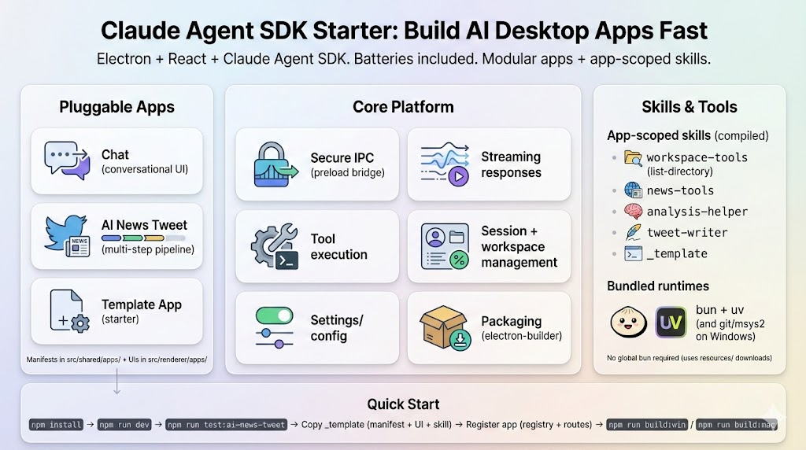
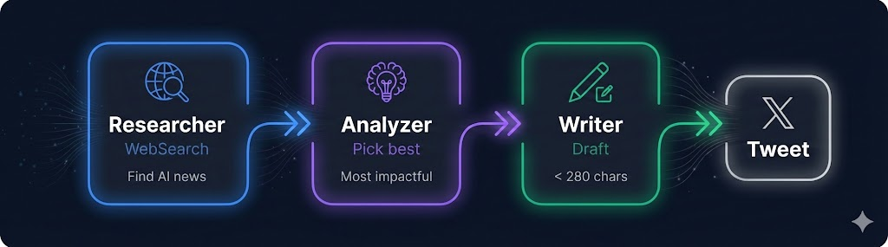
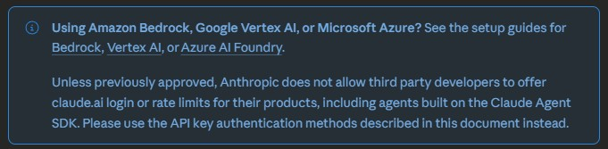

# Claude Agent SDK Starter

[](https://www.npmjs.com/package/@anthropic-ai/claude-agent-sdk)
[](LICENSE)

> **A minimal, batteries-included starter for building AI-powered desktop apps with the official Claude Agent SDK.**
>
> **This uses [@anthropic-ai/claude-agent-sdk](https://www.npmjs.com/package/@anthropic-ai/claude-agent-sdk)** - Anthropic's official SDK. Not a workaround. Not spoofing anything. The right way to build with Claude.



## Why I Built This

I love building developer tools. Check out my other repos - I'm genuinely excited about what AI can do for developers and I want to help others build with it.

There's a lot of talk about the Claude Agent SDK but few real examples of how to build with it. This starter kit exists to:

1. **Inspire builders** - Show what's possible with the SDK, not just document it
2. **Separate pipelines from UI** - Pipelines run headlessly; the UI is just a window into them
3. **Demonstrate built-in power** - The SDK gives apps capabilities that would take months to build from scratch
4. **Show deterministic patterns** - Constrain agent calls with specific tools and skills for consistent, production-ready results

## Demo: AI News Tweet Pipeline

This demo shows **multi-agent orchestration** - three specialized agents working together. Each agent has a single job. The output of one becomes the input to the next. This is how you build reliable AI workflows.



```bash
npm run test:ai-news-tweet
```

## Quick Start

**Prerequisites:**
- [Node.js](https://nodejs.org/) v18+
- [Claude Code CLI](https://docs.anthropic.com/en/docs/claude-code) installed and authenticated

```bash
npm install
npm run dev
```

That's it. No API key needed - uses your Claude Code CLI authentication. Runtime binaries (bun, uv, git, msys2) download automatically on first run.

## Project Structure

```
.claude/
  agents/ai-news-tweet/     # Agent definitions (researcher, analysis, writer)
  skills/                   # Skill definitions with scripts
  rules/                    # Behavior rules auto-loaded by Claude Code
scripts/
  downloadRuntimeBinaries.js  # Downloads bun, uv, git, msys2
  beforeBuild.js              # Pre-build hook (downloads + copies deps)
  dev.js                      # Dev mode launcher
  test-ai-news-tweet.ts       # Pipeline test script
src/
  main/                     # Electron main process
  renderer/                 # React frontend
  preload/                  # IPC bridge
  shared/apps/              # App manifests and registry
resources/                  # Runtime binaries (gitignored)
```

## Building Your Own App

1. **Copy** the `_template` app as your starting point
2. **Configure** the manifest with your app's name, skills, and system prompt
3. **Register** your app in the registry
4. **Run** `npm run dev`

See [docs/BUILDING_APPS.md](docs/BUILDING_APPS.md) for the full guide with code examples.

## Authentication

The SDK routes through Claude Code CLI, using your existing Claude Pro/Max subscription. No API key required for personal development.

### What's Allowed

| Use Case | Allowed? |
|----------|----------|
| Personal development / learning | ✅ Yes |
| Internal team tools (each user has their own Claude subscription) | ✅ Yes |
| Distributed app where users bring their own API key | ✅ Yes |
| Distributed app using YOUR subscription for all users | ❌ No |

> **Policy Note:** Anthropic does not allow third-party developers to offer claude.ai login or share rate limits for their products. Each user must authenticate with their own credentials.
>
> See the [official Agent SDK documentation](https://platform.claude.com/docs/en/agent-sdk/overview) for full details.



If you distribute an app to others, each user must provide their own API key via `ANTHROPIC_API_KEY`.

### Alternative Providers

The SDK officially supports these Claude providers:

| Provider | Environment Variable |
|----------|---------------------|
| **Amazon Bedrock** | `CLAUDE_CODE_USE_BEDROCK=1` + AWS credentials |
| **Google Vertex AI** | `CLAUDE_CODE_USE_VERTEX=1` + Google Cloud credentials |
| **Microsoft Foundry** | `CLAUDE_CODE_USE_FOUNDRY=1` + Azure credentials |

### Custom Endpoints

The SDK supports any Anthropic-compatible API via `ANTHROPIC_BASE_URL`. Z.AI GLM is included as an example:

> **Note:** Z.AI uses Zhipu AI's GLM models, not Claude. This is useful for cost savings or when Claude is unavailable in your region, but you're running a different model.

Configure in Settings or via environment:

```bash
GLM_API_KEY=your-zai-api-key
```

Other Anthropic-compatible endpoints work the same way using `ANTHROPIC_BASE_URL` and `ANTHROPIC_AUTH_TOKEN`.

## Runtime Binaries

The Claude Agent SDK needs certain tools to run scripts:

- **bun** - JavaScript runtime for skill scripts
- **uv** - Python package manager for Python skills
- **git + msys2** (Windows) - Shell utilities (bash, grep, sed)

These download automatically on first `npm run dev`. No manual installation required.

## Build for Distribution

```bash
npm run build:win    # Windows installer
npm run build:mac    # macOS app
```

Output goes to `dist/` with all runtime binaries included.

## Commands

```bash
# Development
npm run dev              # Start dev mode with hot-reload
npm run build            # Build for production
npm run typecheck        # Type check
npm run lint             # Lint code

# Testing
npm run test:ai-news-tweet   # Run pipeline test
npm run test:bypass-auth     # Test SDK authentication
npm run test                 # Run unit tests

# Build for distribution
npm run build:win        # Windows installer
npm run build:mac        # macOS app
```

## Troubleshooting

See [docs/TROUBLESHOOTING.md](docs/TROUBLESHOOTING.md) for common issues and solutions.

## Questions & Compliance

If you have questions about SDK usage, authentication, or compliance:

1. **Open an issue** on this repo - I'm happy to help
2. **Check the official docs** - [Agent SDK Overview](https://platform.claude.com/docs/en/agent-sdk/overview)
3. **Contact Anthropic** - For branding or commercial licensing questions, reach out to [Anthropic's sales team](https://www.anthropic.com/contact-sales)

This starter kit follows Anthropic's published guidelines. If you believe something here doesn't comply with their terms, please open an issue and I'll address it.

## License

MIT

---

**Built with the [Claude Agent SDK](https://www.npmjs.com/package/@anthropic-ai/claude-agent-sdk)** | [Official Documentation](https://platform.claude.com/docs/en/agent-sdk/overview)
